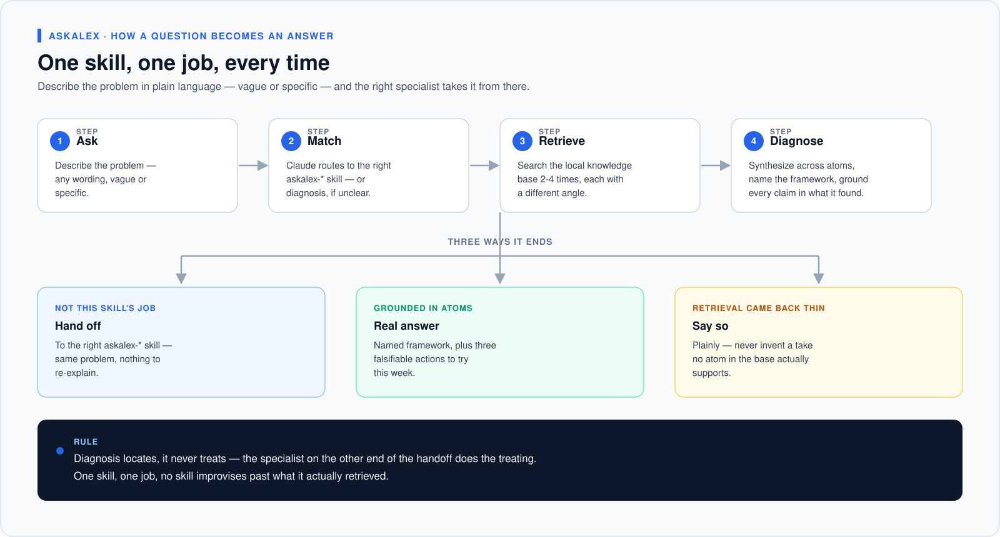
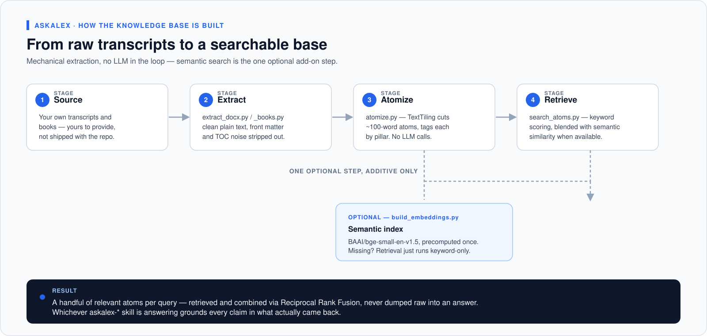
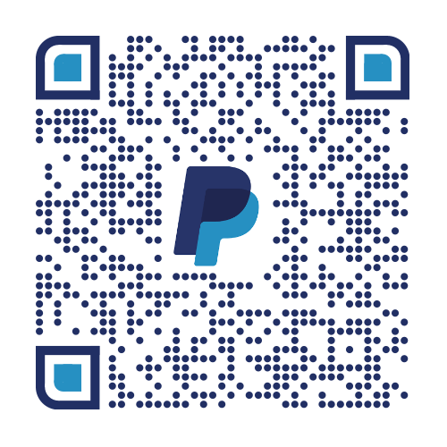

# AskAlex

[English](README.md) | 简体中文

**一个 24/7 在线的商业教练，思考方式复刻 Alex Hormozi。**


> 有人愿意花 35,000 美元飞去拉斯维加斯待两天，就为了让 Alex 自己的团队帮他们找到生意里真正卡住的地方，再交给他们对应的框架去解决。这套系统装的是同一套方法：先定位真正卡住的地方，说清楚背后用的是哪个框架，再给你三件这周就能验证的具体动作，每一件都有办法判断有没有用。

非官方项目，与 Alex Hormozi 或 Acquisition.com 没有任何关联或授权关系。这是一个粉丝自建的学习型工具——详见[免责声明](#免责声明)。

---



## AskAlex 解决什么问题

大多数"AI 商业建议"死在两个地方：要么泛用到套哪个生意都行（等于对谁都没用），要么只回答你问出来的那句话，而不是那句话背后真正的问题。"我该不该涨价？"很少真的是定价问题——它通常是 offer 问题、激活问题，或者披着定价外衣的"找错客户"问题。

AskAlex 先诊断，再开处方。九个专家 skill 各管一块（offer、价格、offer 之间的顺序、客户终身价值、留存、销售、获客，还有经营者自己的心态），外加一个负责"你到底该用哪一个"的总入口、一个负责"事情不止一件、先做哪个"的排序 skill，以及一个负责"东西已经试过了、这个赌到底对不对"的复盘 skill。

| 真实处境 | 你会得到 |
|---|---|
| 客户说太贵了，但你不确定是价格、offer 还是话术的问题 | 一个定位清楚的约束点、背后的机制，以及三个可证伪的动作——而不是一个猜测 |
| 一个转化不好的 offer，或者压根还没有 offer | 四变量审计（Value Equation），或者从零搭一个 offer，最后浓缩成一句话，客户看得懂 |
| 卖得动但利润薄，账上总是紧 | 把你现有的 offer 顺序对照三段式 Money Model 摊开，指出缺的是哪一段 |
| 客户总在差不多同一个时间点流失 | 找到激活点、衰减曲线，以及该出手干预的具体那一周 |
| 有线索但成不了单，或者压根没人找上门 | 分流到对的那个——leadgen（没人跟你聊）还是 sales（聊了但成不了） |
| "我知道该做什么，就是迟迟不做" | entrepreneurship skill——这是唯一一个卡点是"人"而不是"生意"的情况 |

## 快速开始

```bash
git clone https://github.com/izhonggu/askalex.git
cd askalex
```

先读[知识库](#知识库--需要你自己搭建)这一节——这些 skill 需要一份本地的 `knowledge/atoms/atoms.jsonl` 才能检索，这个仓库**故意**没有附带（原因见下文）。

然后把 skill 装进 Claude Code：

```bash
# 项目级——只在这个项目里生效
mkdir -p /path/to/your/project/.claude/skills
cp -r skills/askalex-* /path/to/your/project/.claude/skills/

# 或者全局——所有项目都能用
cp -r skills/askalex-* ~/.claude/skills/
```

装完之后，直接描述问题就行，不用管该用哪个 skill：

```text
/askalex 我做付费教练业务，每月 500 美元，客户大概第三个月就开始流失。
我是不是该直接涨价？
```

`askalex` 是总入口——它会先判断这个情况是某一个专家 skill 直接能接的，还是需要先诊断，然后一口气给出答案（这个例子里，它会诊断出真正的问题是留存而不是定价，然后直接接着给出留存方向的建议——不用你再问一次）。具体示例见 [`skills/askalex/SKILL.md`](skills/askalex/SKILL.md)。

如果你已经明确知道要什么，可以跳过总入口直接说——"帮我审计这个 offer""帮我涨价""为什么客户总在流失"——Claude 会直接匹配到对应的专家 skill。

## 十二个 skill

一个总入口，一个排序器，一个复盘器，九个专家：

| Skill | 什么问题该用它 | 核心框架 |
|---|---|---|
| `askalex` | **不确定该用这几个里的哪一个**——总入口 | 直接路由，或者先诊断再接入对的专家 skill |
| `askalex-diagnosis` | **整个生意**，你说不清到底哪里疼 | 三个增长杠杆 → 定位约束，再转交 |
| `askalex-plan` | **手上已经不止一件事要做**——来自诊断、来自好几个专家、或者你自己列的清单——需要知道先做哪个 | Scaling Roadmap 十阶段模型 + 一次只攻一个约束 |
| `askalex-retro` | **已经试过了某个建议，结果出来了**——这个赌到底对不对，接下来怎么办 | 干净测试检查 + 证伪打分 + "shaking the three" |
| `askalex-offer` | **单个 offer**——搭建它，或者搞清楚它为什么转化不好 | Value Equation（四变量）+ Grand Slam Offer（九步法） |
| `askalex-pricing` | **数字和条款**——收多少、涨不涨、怎么计费 | 三种定价模型 + 10 个 pricing plays + 价格/价值/流失三角 |
| `askalex-businessmodel` | **结构本身**——没有后端、CAC 回不了本、账上总缺钱 | Money Model：引流 → 追加/降级销售 → 持续续费 |
| `askalex-ltv` | **单个客户的总价值**——让每个客户在整个关系周期里更值钱 | LTGP 算法 + Crazy Eight 八个杠杆 |
| `askalex-retention` | **客户为什么走**——流失、激活、头 30 天 | Churn Checklist + 激活点 |
| `askalex-sales` | **已经在对话里的人**——成交率、异议、话术 | 三个桶 + Onion of Blame + 具名 closes |
| `askalex-leadgen` | **没人找上门**——线索不够、渠道单一 | Core Four（熟人/陌生 × 一对一/一对多） |
| `askalex-entrepreneurship` | **人本身**——恐惧、信念、自律、倦怠、坚持不下去 | 痛苦 / 信念 / 恐惧 / 身份 / agency / 耐心 |

完整的路由表、skill 之间的边界规则和共享约定都在 [`skills/README.md`](skills/README.md) 里——想加第十三个 skill 之前先读一遍，现有十二个为了不互相打架是真花了功夫的。

## 工作原理

每个 skill 回答之前都会先在知识库里落地：检索相关内容，综合而不是把原始结果直接倒出来，点名用到的框架，检索结果稀薄时就直说，不编造答案。共享规则见 [`skills/README.md`](skills/README.md#shared-rules)。

## 知识库 —— 需要你自己搭建



这个仓库公开的是**skill 和处理管线**，不是一份预建好的知识库。这是一条刻意划的线，不是漏做了：

原子化管线（`atomize.py`）的做法是按语义边界把原文切成约 100 词一段——它**不做**转述或摘要。如果拿去处理有版权的素材（书籍、付费课程内容），产出的就是那份材料的近乎原文切片，只是被分了块。把这个跟 skill 一起分发出去，等于在分发别人的付费内容，这个项目不会这么做。

自己搭建的方法：

```bash
python3 scripts/extract_docx.py      # 你的 .docx 逐字稿 -> 纯文本
python3 scripts/extract_books.py     # 你的 PDF/EPUB 书籍 -> 纯文本（需要 poppler：brew install poppler）
python3 scripts/atomize.py           # 两者 -> knowledge/atoms/atoms.jsonl
```

只有一种素材的话可以用 `atomize.py --sources books` 或 `--sources transcripts`。文件结构、`--strong-only` 过滤参数（口语转录里大约 70% 是闲聊/填充内容）说明见 [`knowledge/_README.md`](knowledge/_README.md)，pillar 分类体系见 [`knowledge/_taxonomy.md`](knowledge/_taxonomy.md)。

如果你想把这整套系统用在**你自己**的业务内容上，而不是 Hormozi 的——你自己的 YouTube 频道、你自己的内部方法论文档——这套管线不关心素材是谁的。skill 里的框架逻辑（Value Equation、Money Model 各阶段、Crazy Eight 等）作为诊断框架照样好用，变的只是检索出来的具体例子。

## 仓库结构

```text
askalex/
├── skills/
│   ├── README.md              路由表 + 共享规则
│   ├── askalex/SKILL.md       总入口——直接路由，或先诊断再接入
│   └── askalex-*/SKILL.md     askalex-plan、askalex-retro + 九个专家 skill
├── scripts/
│   ├── extract_docx.py        逐字稿 -> 纯文本
│   ├── extract_books.py       PDF/EPUB -> 纯文本
│   ├── atomize.py             纯文本 -> knowledge/atoms/atoms.jsonl
│   └── search_atoms.py        每个 skill 都会调用的检索器
└── knowledge/
    ├── _taxonomy.md           10 个 pillar 的分类规则（A1-E）
    ├── _README.md             卡片库 vs 原子库，重建说明
    └── atoms/                 已在 .gitignore 里排除——自己搭建，见上文
```

## 适合谁用

- 想要一个真正结构化的诊断、而不是心灵鸡汤的创始人、教练、咨询顾问和代理机构运营者
- 想把 Alex 的框架当成自己 agent 里的一个**思考工具**、而不是想去上一门课的人
- 对管线本身感兴趣的开发者——TextTiling 语义分段、带先验权重的 pillar 打分、不经过 LLM 的检索——这套东西换成任何语料都能用，不限于商业内容

## 不适合谁

- 想直接下载一份预打包好的 Hormozi 知识库的人——为什么这里不提供，见[上文](#知识库--需要你自己搭建)
- 想要一次性内容生成（广告文案、社媒帖子、落地页）的场景——这里每个 skill 做的都是诊断和开处方，没有一个是用来产出可发布文案的
- 需要 skill 假扮 Alex 第一人称说话、或者直接引用他原话的场景——这两条都是 skill 设计上的硬规则，拒绝执行（见[免责声明](#免责声明)）

## 免责声明

AskAlex 是一个独立的、粉丝自建的项目，**与 Alex Hormozi 或 Acquisition.com 没有任何关联、未经其认可或审核**。文中引用的框架（Value Equation、Grand Slam Offer、Money Model、Crazy Eight 等）来自他的公开教学内容，为了这个项目的需要做了提炼和转述——不是经过许可或官方认证的材料。

## 许可证

[MIT](LICENSE)——覆盖的是这个仓库里的 skill 和管线代码，仓库里也只有这些内容。这份许可证跟 Alex Hormozi 本人的书籍或教学内容无关，也不授予任何相关权利；如果你按照上文的方法用他（或任何其他人）有版权的材料搭建了自己的知识库，那份材料仍然受它自己的版权保护，你可以在本地使用，但不能再分发出去。

## 框架来源

Alex Hormozi 的公开教学内容——YouTube、书籍和演讲。

## 作者与支持

作者：Zhong —— [X](https://x.com/izhonggu) · [LinkedIn](https://www.linkedin.com/in/guzhong/) · [Newsletter](https://sendfox.com/lp/1w0zkj) · [hardcoremkt.com](https://hardcoremkt.com/)

搭这套东西投入了相当多的时间、反复打磨和 token 消耗——如果这里的某次诊断帮你省下了一次付费咨询，欢迎请我喝杯咖啡，这也能帮着把项目维护下去。

<a href="https://www.paypal.com/qrcodes/managed/6048bb04-3f01-4e36-8a8a-77422345af41?utm_source=consweb_more"></a>

**[PayPal 打赏](https://www.paypal.com/qrcodes/managed/6048bb04-3f01-4e36-8a8a-77422345af41?utm_source=consweb_more)**
